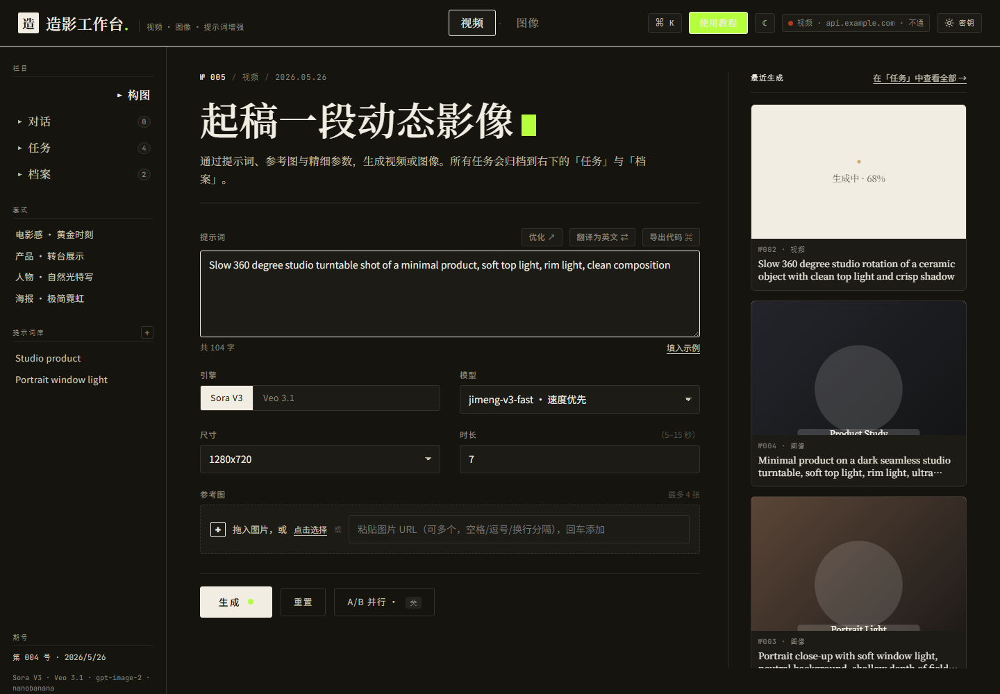
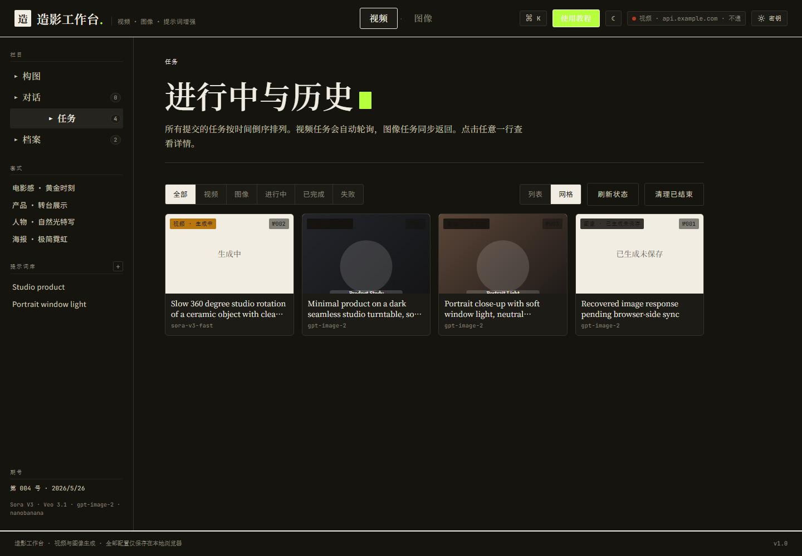
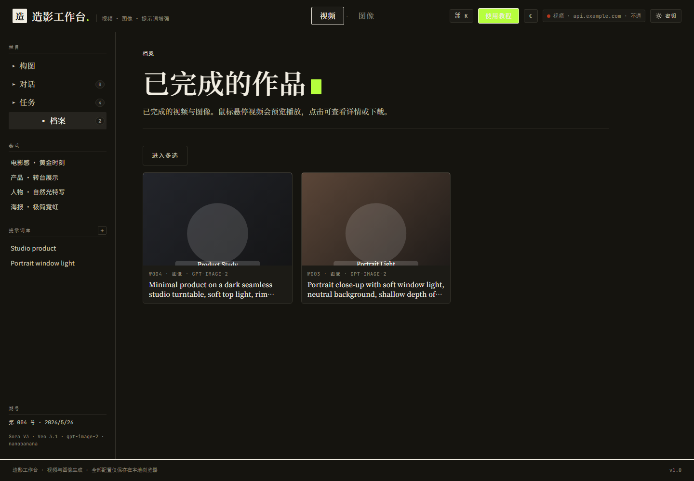
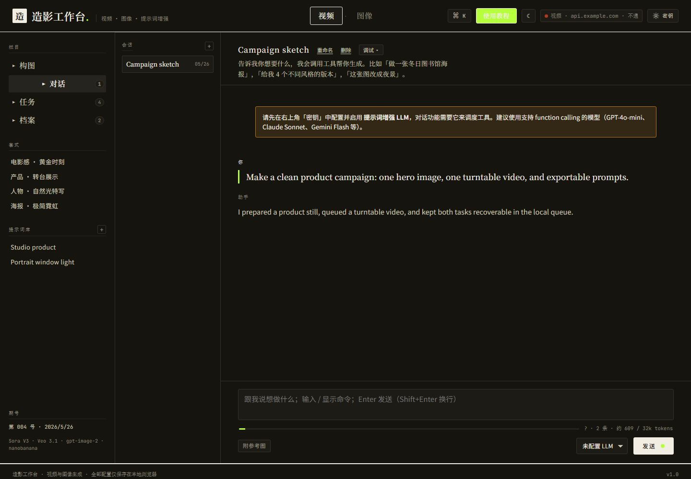

# Zaoyin

Self-hosted video and image generation workbench.

Zaoyin is a browser-first workspace for generating images, videos, and prompt-assisted chat workflows through OpenAI-compatible and Gemini-compatible upstream APIs. User settings, tokens, task history, prompts, and generated assets are stored in the browser's IndexedDB by default.



## Features

- Image generation and image editing through compatible upstream APIs
- Video task submission, polling, preview, and browser-side caching
- Local task queue with list/grid views, retry, delete, and ZIP export
- Optional LLM agent for prompt optimization and tool-assisted workflows
- Server-side proxy for CORS, range requests, and short-lived image response recovery
- Browser-local storage for user data and generated assets

## Screenshots

| Task queue | Archive |
|---|---|
|  |  |

| Agent workspace |
|---|
|  |

## Requirements

- Node.js 20+
- npm
- An upstream API gateway that exposes the model routes you want to use

## Run Locally

```bash
npm install
UPSTREAM=https://your-api.example.com npm start
```

The service listens on `PORT` or `8080`.

Open:

```text
http://localhost:8080
```

## Docker

```bash
docker build -t zaoyin .
docker run --rm -p 8080:8080 -e UPSTREAM=https://your-api.example.com zaoyin
```

## Configuration

Runtime environment variables:

| Variable | Default | Description |
|---|---:|---|
| `PORT` | `8080` | HTTP port |
| `UPSTREAM` | `https://api.example.com` | Upstream API base URL |
| `IMAGE_JOB_DIR` | `.image-jobs` | Short-lived image response cache directory |
| `IMAGE_JOB_TTL_MS` | `86400000` | Image response recovery cache TTL |
| `MAX_IMAGE_RESPONSE_BYTES` | `83886080` | Maximum cached image JSON response size |

Tokens are entered in the web UI and stored in browser IndexedDB. They are sent to the local server only for proxying upstream requests.

## Data Storage

By default:

- Browser IndexedDB stores settings, tokens, conversations, task records, prompt library entries, references, and cached media blobs.
- The server stores only short-lived image generation JSON responses for recovery after accidental refreshes. The default TTL is 24 hours.
- No database is required.

## GitHub Actions

The included workflow builds and pushes a Docker image to GitHub Container Registry for the repository owner:

```text
ghcr.io/<owner>/<repo>:latest
```

## License

MIT
